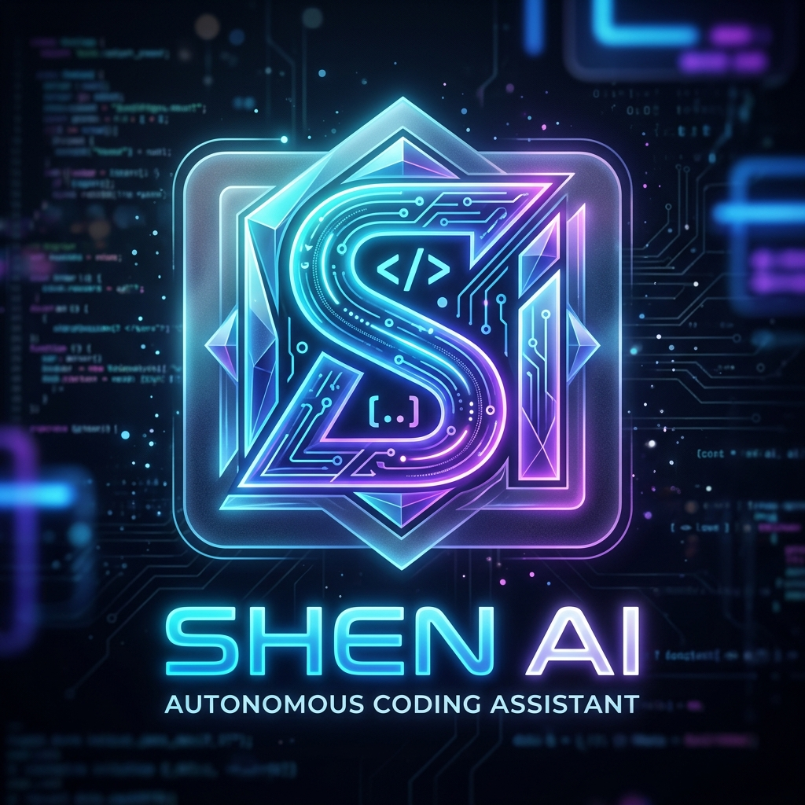

<div align="center">
  
  <h1>SHEN AI — Autonomous Coding Agent</h1>
  <p><strong>A superior multi-agent, multi-provider AI coding assistant that thinks ahead, learns from you, and builds autonomously.</strong></p>
  <p>
    
    
    
  </p>
</div>

---

## 🌟 Introduction

SHEN AI isn't just another chat-in-your-editor tool. It's a **complete autonomous development system** designed to revolutionize your workflow. 
Whether you're scaffolding a new project from scratch, refactoring legacy systems, or tracking down obscure bugs, SHEN AI acts as a deeply integrated co-creator inside your VS Code workspace.

With SHEN AI, you get an AI that actually **modifies, tests, and reads your codebase securely**, executing terminal commands and keeping track of your personal coding DNA over time.

---

## ✨ Key Features

| Feature | Description |
|---------|-------------|
| 🧠 **Act & Plan Modes** | Choose whether the AI should autonomously modify files and run commands (Act) or carefully analyze and write step-by-step implementation plans (Plan). |
| 🤖 **Swarm Mode Orchestration** | Deploys specialized sub-agents (Coder, Architect, Debugger) that collaborate to solve complex problems faster than a single AI. |
| 🧬 **Self-Evolving Prompts** | Tracks your corrections and edits. SHEN AI *learns* your style and preferences, meaning you never have to correct the same mistake twice. |
| 🌍 **Multi-Provider Support** | Plug and play with your favorite LLMs. Full support for **Anthropic (Claude)**, **OpenAI (GPT)**, **Google (Gemini)**, **Mistral**, **Groq**, **Azure**, and local models via **Ollama** or custom endpoints! |
| 🎭 **Personality Engine** | Change your AI pair-programmer's personality on the fly. Choose from a strict Code Reviewer, a patient Mentor, a quick-and-dirty Hacker, or a concise Senior Dev. |
| 🕸️ **Project Genome** | Maintains a living knowledge graph of your entire codebase, giving SHEN AI unmatched context over cross-file dependencies. |

---

## 🚀 Getting Started

### Installation

1. Install SHEN AI from the **VS Code Marketplace** *(Coming soon!)*.
2. Open the **SHEN AI** sidebar panel (click the sparkle icon in your Activity Bar).
3. Follow the quick onboarding instructions to configure your preferred AI provider.

### Configuration

If you don't have an API key configured, SHEN AI will automatically prompt you to enter one when you open the panel.
1. Select your preferred provider (e.g., Anthropic, OpenAI, Google Gemini, or a local provider like Ollama).
2. Enter your API Key or Custom Base URL.
3. Choose your desired AI Model and hit **Save**.

---

## 💡 How to Use SHEN AI

- **Open the Chat:** Click the `SHEN AI` icon in the sidebar or run `SHEN AI: Open Chat Panel` from the Command Palette (`Ctrl+Shift+P`).
- **Plan vs Act:** Use the toggle at the top of the chat input to switch between `Act` mode (AI can modify your files) and `Plan` mode (AI will only read files and generate text plans).
- **Change Personality:** Use the dropdown in the chat input to switch your AI's tone (e.g., Senior Dev, Mentor, Hacker) to fit your current task perfectly.
- **Cancel a Task:** If SHEN AI is taking an action you want to stop, press the `Stop` (■) button near the input bar to instantly halt the agent loop.

---

## 🛠️ For Developers & Contributors

Want to build or modify SHEN AI yourself? Here is how the magic happens:

### How it Works

SHEN AI uses a **Swarm Architecture** with isolated React UI and Node.js Extension components.
- The `webview` (React UI) communicates with the `extension` (Node.js backend) via VS Code's `postMessage` protocol.
- The core loop is managed by `ChatManager`, which routes commands to the `ToolRegistry` and tracks tokens and history.
- Context is strictly managed to ensure massive codebases don't exceed LLM token limits.

### Local Development

1. Clone the repository to your local machine:
   ```bash
   git clone https://github.com/shenald-dev/shen-ai.git
   ```
2. Run `npm install` to download dependencies.
3. Run `npm run watch` (or `node esbuild.js --watch`) to compile the extension.
4. Press `F5` in VS Code to launch the Extension Development Host.

### Releasing to GitHub and the Marketplace

If you modify SHEN AI locally and want to publish your version:

1. **Pushing to GitHub:**
   Commit your changes using git. You can do this yourself via the terminal, or simply tell SHEN AI: *"Commit and push my latest changes to GitHub."*
   
2. **Publishing to the VS Code Marketplace (Automated):**
   This repository is configured with a **GitHub Actions CI/CD pipeline**. 
   - When you are ready to release a new version, bump the version number in `package.json`.
   - Create a git tag starting with `v` (e.g., `git tag v1.0.0`).
   - Push the tag to GitHub (`git push origin v1.0.0`).
   - GitHub Actions will automatically compile, package, and upload the new version directly to the VS Code Marketplace! *(Note: You must first configure the `VSCE_PAT` secret in your GitHub repository settings).*

---

<div align="center">
  <b>Built with ❤️ by Shenal D (<a href="https://github.com/shenald-dev">@shenald-dev</a>) and advanced AI engineering.</b>
</div>